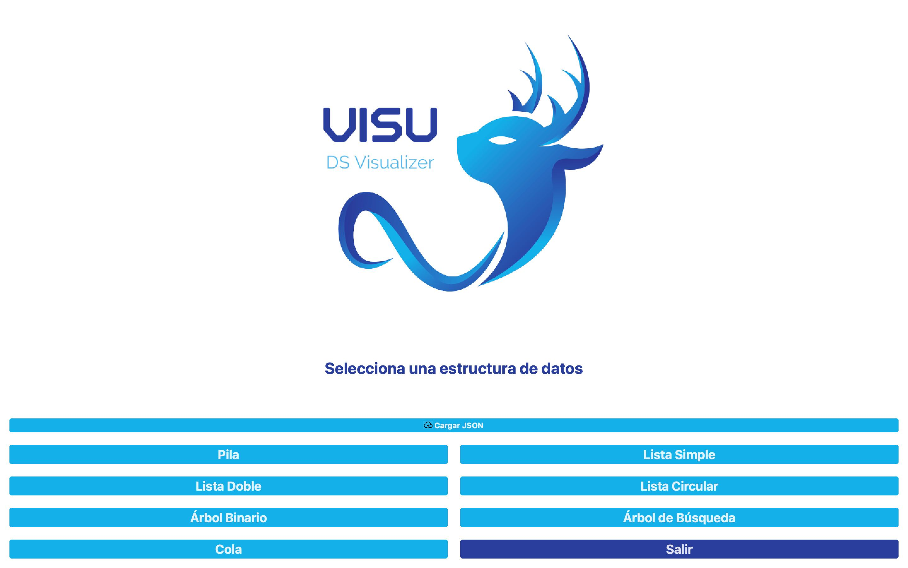
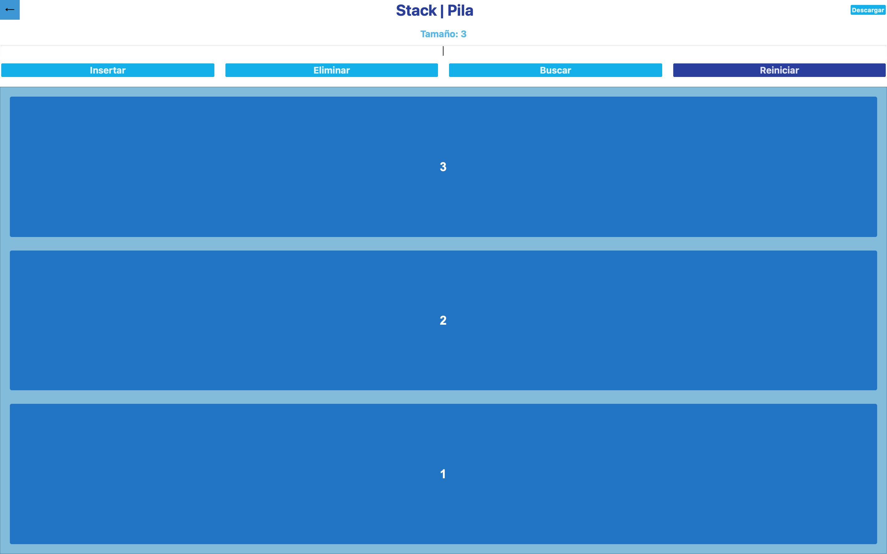
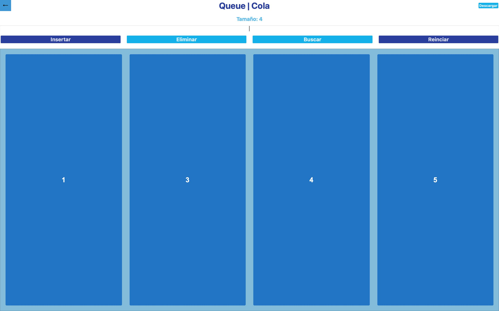
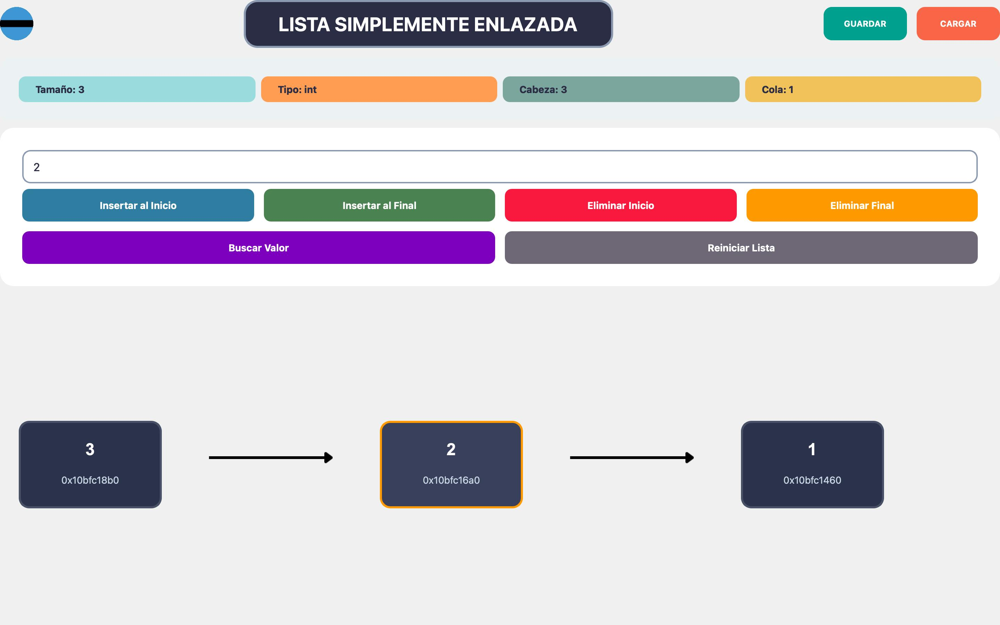
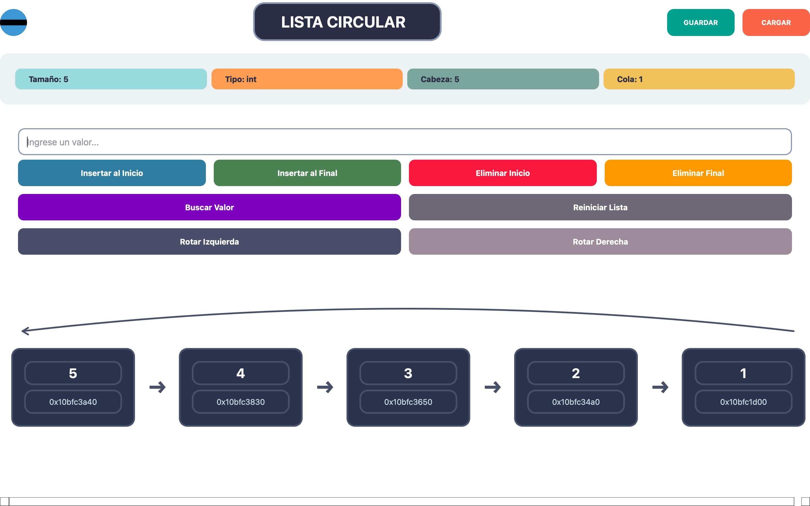
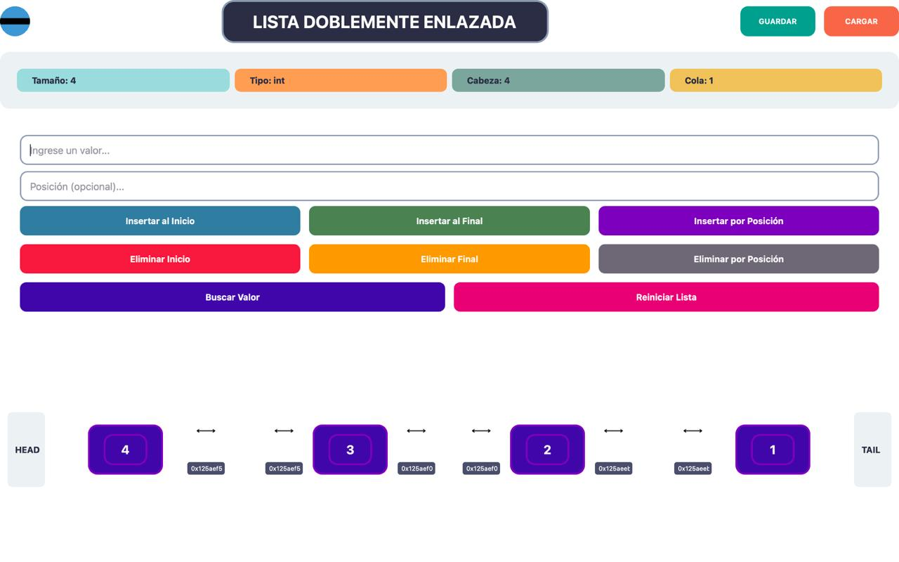
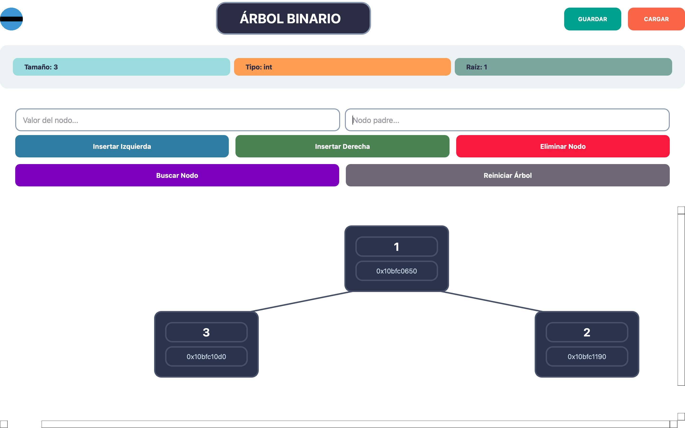
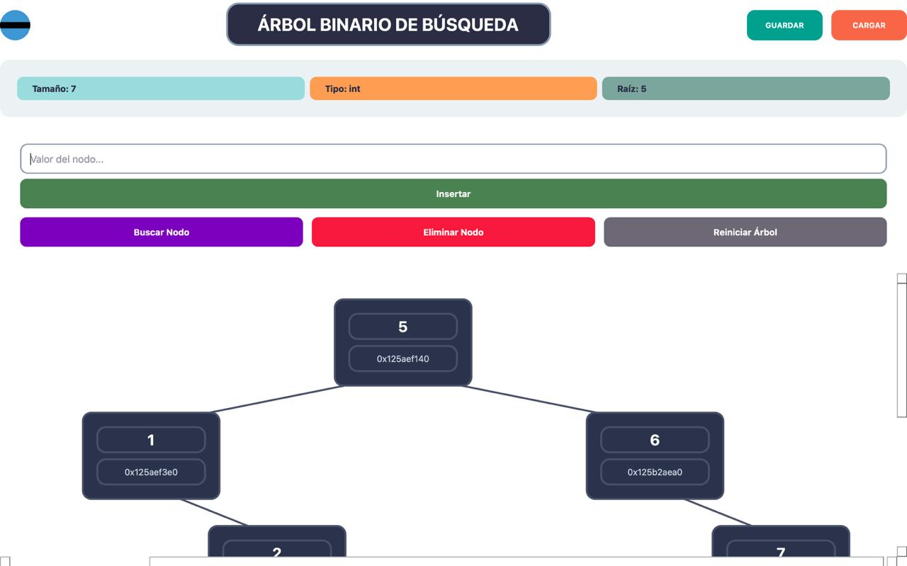

# Visualizador de Estructuras de Datos

  

## 📚 Descripción del Proyecto

Este software permite visualizar e interactuar con diferentes estructuras de datos lineales y no lineales a través de una interfaz gráfica intuitiva. Su objetivo principal es facilitar la comprensión de estas estructuras fundamentales en la programación mediante representaciones visuales dinámicas que muestran su comportamiento en tiempo real.
El visualizador ofrece una experiencia práctica donde los usuarios pueden ver cómo las diferentes operaciones afectan a cada estructura, observando las conexiones entre nodos, los cambios en la organización y el flujo de datos. 

## ✨ Características Principales

- Visualización gráfica en tiempo real de estructuras de datos:
  - Pilas
  - Colas
  - Listas simplemente enlazadas
  - Listas circulares
  - Listas doblemente enlazadas
  - Árboles binarios
  - Árboles de búsqueda
- Operaciones específicas para cada estructura (insertar, eliminar, buscar, etc.)
- Almacenamiento de diferentes tipos de datos: enteros, flotantes, booleanos, cadenas de texto
- Permite guardar y cargar estructuras desde archivos

## 🖥️ Dashboard

Nuestro dashboard tiene una interfaz clara e intuitiva que permite:

- Seleccionar el tipo de estructura de datos a visualizar
- Escoger el tipo de datos a almacenar
- Ejecutar operaciones específicas de cada estructura
- Ver la representación gráfica de la estructura
- Guardar y cargar estructuras desde archivos

  

## 🧩 Estructuras de Datos Implementadas

### Pila (Stack)

Una estructura de datos lineal que sigue el principio LIFO (Last In, First Out), donde el último elemento insertado es el primero en ser eliminado. Ideal para situaciones donde el orden de procesamiento es inverso al orden de llegada.

  

**Operaciones implementadas:**
- Insertar elemento
- Eliminar elemento
- Buscar valor

### Cola (Queue)

Una estructura de datos lineal que sigue el principio FIFO (First In, First Out), donde el primer elemento insertado es el primero en ser eliminado. Perfecta para modelar situaciones de espera o procesamiento en orden de llegada.

  

**Operaciones implementadas:**
- Insertar elemento
- Eliminar elemento
- Buscar valor

### Lista Simplemente Enlazada

Una estructura de datos lineal donde cada elemento (nodo) contiene un valor y una referencia al siguiente nodo. Permite un acceso secuencial a los elementos y es eficiente para inserciones y eliminaciones al inicio.

  

**Operaciones implementadas:**
- Insertar al inicio
- Insertar al final
- Eliminar al inicio
- Eliminar al final
- Buscar valor

### Lista Circular

Similar a la lista simplemente enlazada, pero el último nodo apunta al primero, formando un ciclo. Esta estructura es útil cuando se necesita un acceso continuo y cíclico a los elementos.

  

**Operaciones implementadas:**
- Insertar al inicio
- Insertar al final
- Eliminar al inicio
- Eliminar al final
- Buscar valor
- Rotar a la izquierda
- Rotar a la derecha

### Lista Doblemente Enlazada

Una estructura de datos lineal donde cada nodo contiene un valor y referencias tanto al nodo siguiente como al anterior. Permite recorrer la lista en ambas direcciones y facilita ciertas operaciones como la eliminación.

  

**Operaciones implementadas:**
- Insertar al inicio
- Insertar al final
- Insertar por posición
- Eliminar al inicio
- Eliminar al final
- Eliminar por posición
- Buscar valor

### Árbol Binario

Una estructura de datos jerárquica donde cada nodo puede tener como máximo dos hijos (izquierdo y derecho). Es fundamental para representar relaciones jerárquicas y para algoritmos de búsqueda y ordenamiento.

  

**Operaciones implementadas:**
- Insertar a la izquierda
- Insertar a la derecha
- Eliminar nodo
- Buscar valor

### Árbol de Búsqueda

Un tipo especial de árbol binario donde los valores menores al nodo raíz se almacenan en el subárbol izquierdo y los valores mayores en el subárbol derecho. Esta propiedad se mantiene recursivamente en todos los nodos, permitiendo búsquedas eficientes.

  

**Operaciones implementadas:**
- Insertar (mantiene el orden)
- Eliminar nodo
- Buscar valor

## 👥 Equipo de desarrollo

- Derek Calderón     1567624
- Javier Rodríguez   1535524
- Adrián Matul       1509224
- Diego Ovalle       1500324
